# Practica 1 - Parte 3: Mini proyectos en entornos de desarrollo

## 1. Introducción

En esta tercera parte de la práctica aplicarás de forma integrada los contenidos trabajados en los capítulos 1, 2 y 3 del material del curso (Datacamp).

La Parte 3 se divide en dos mini proyectos:

- **Parte 3.1:** Visual Studio Code + Metals + Scala 2.12.21 + JDK 17 + sbt.
- **Parte 3.2:** IntelliJ IDEA Community + Scala 2.12.21 + JDK 17 + sbt.

# Parte 3.1 — Visual Studio Code + Metals + sbt

## 3.1.1 Entorno de trabajo

Este mini proyecto deberá realizarse utilizando:

- **Visual Studio Code**
    
    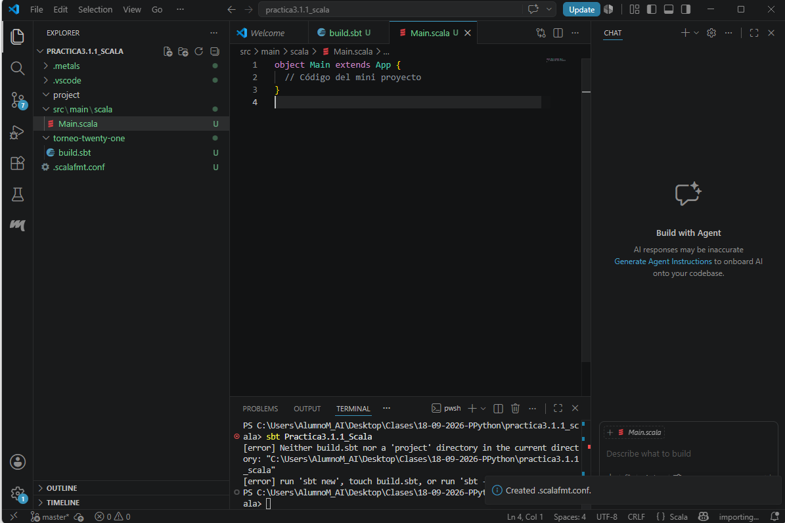
    
- **Metals**
    
    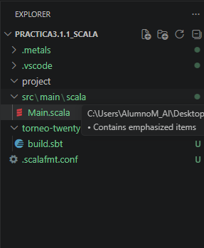
    
- **Scala 2.12.21**
    
    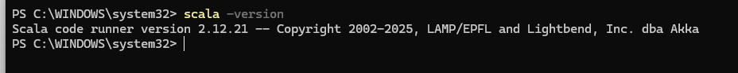
    
- **JDK 17**
    
    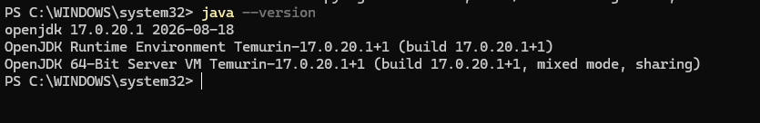
    
- **sbt**
    
    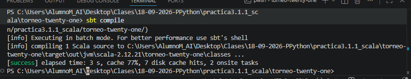
    
- Scala 2.12.21 configurado en `build.sbt`.
    
    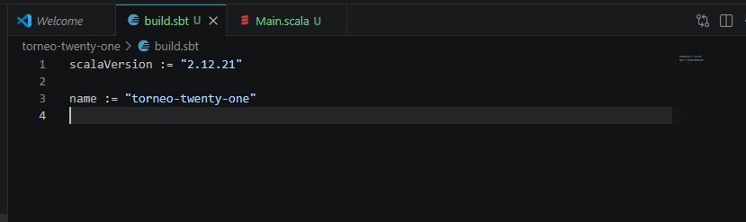
    

El proyecto deberá ser una aplicación Scala organizada con una estructura sbt.

## 3.1.2 Mini proyecto — Clasificador de resultados de un torneo de Twenty-One

### Descripción

Vas a desarrollar un pequeño programa que analice los resultados de varias manos de un torneo de **Twenty-One**.

Cada jugador tendrá:

- Un nombre.
- Una puntuación.

El programa deberá determinar:

- Si cada jugador se ha pasado de 21.
- Qué jugadores tienen una puntuación válida.
- Cuál es la mejor puntuación válida de la ronda.
- Cuántos jugadores se han pasado.
- Cuántos jugadores siguen dentro de la partida.

El proyecto está inspirado en los ejemplos de Twenty-One utilizados en el material del curso (Datacamp), pero deberás construir una solución más completa combinando los conceptos aprendidos.

## 3.1.3 Estructura del proyecto

Crea un proyecto sbt con una estructura equivalente a:

```
torneo-twenty-one/
├── build.sbt
├── project/
└── src/
    └── main/
        └── scala/
            └── Main.scala
```

## 3.1.6 Datos iniciales

Utiliza las siguientes colecciones:

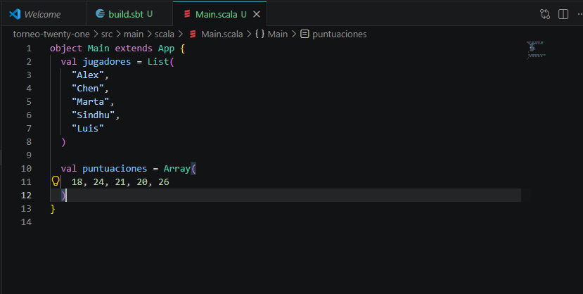

## 3.1.7 Función `bust`

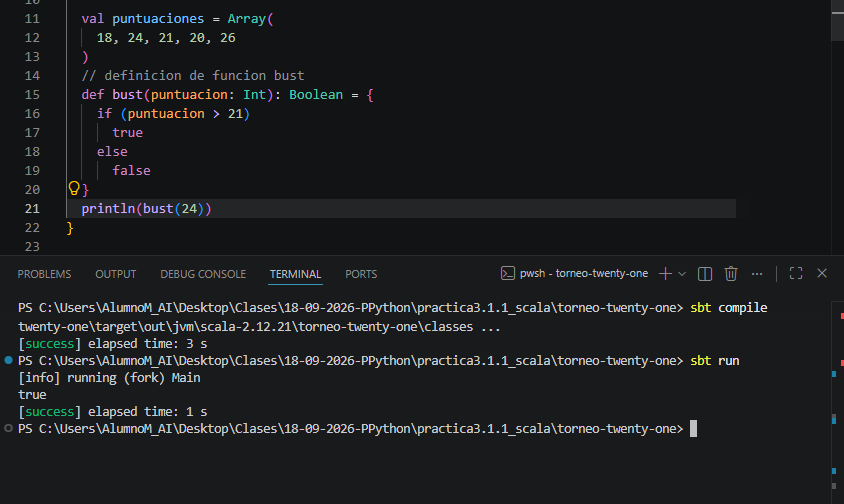

## 3.1.8 Función `estadoMano`

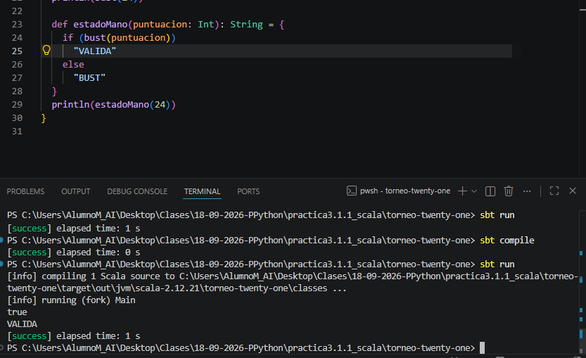

## 3.1.9 Función `mejorMano`

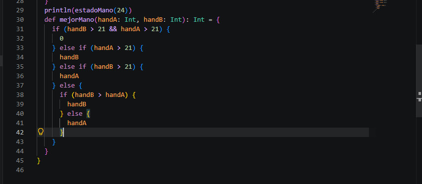

## 3.1.10 Procesamiento de la primera ronda

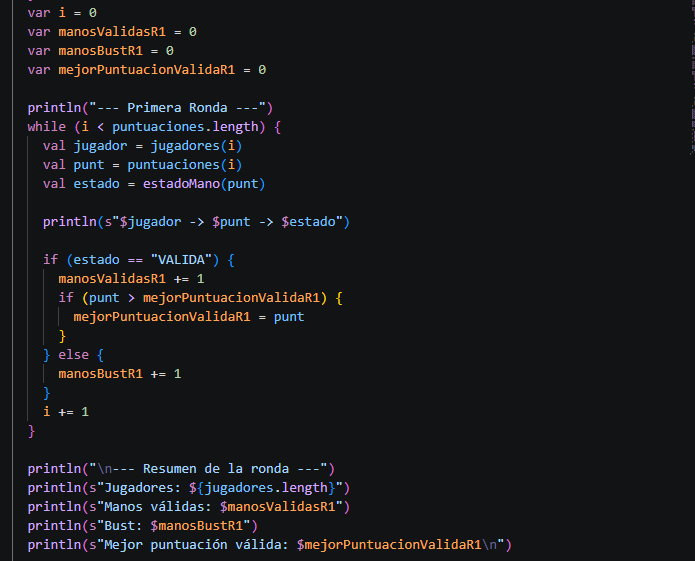

## 3.1.12 Segunda ronda

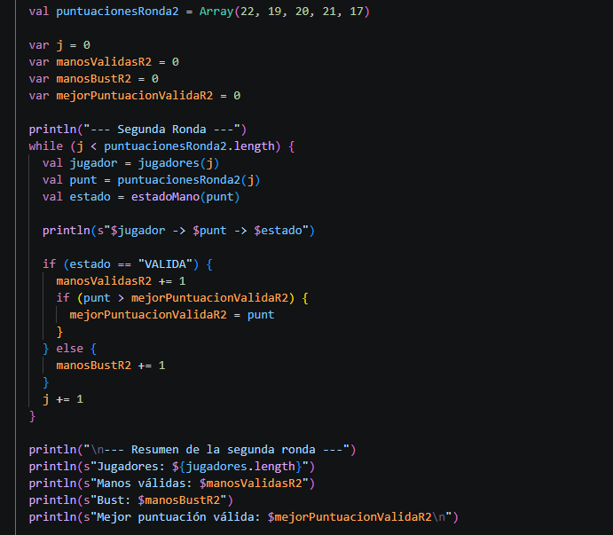

## 3.1.13 Comparación de rondas

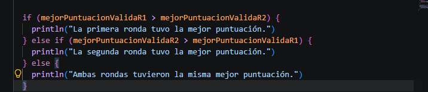

## 3.1.14 Uso de `foreach`

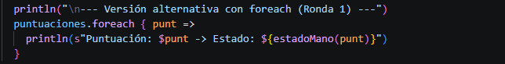

- Compilación correcta.

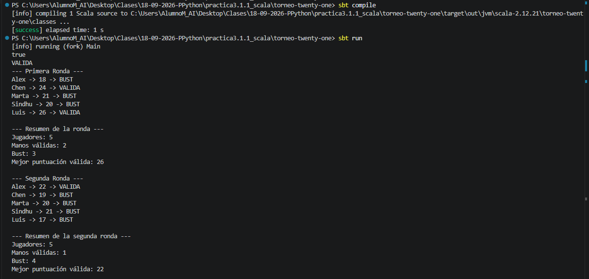

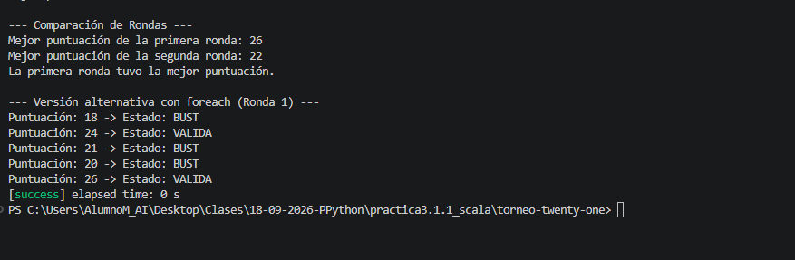

# Parte 3.2 — IntelliJ IDEA Community + sbt

## 3.2.1 Entorno de trabajo

- IntelliJ IDEA abierto.
- Plugin de Scala activo.
- JDK 17 seleccionado.
    
    
    
- Proyecto sbt cargado.
- Scala 2.12.21 configurado.
    
    
    

## 3.2.2 Mini proyecto — Analizador de calificaciones de un grupo

### Descripción

Vas a desarrollar una pequeña aplicación que analice las calificaciones de un grupo de estudiantes.

El programa deberá:

- Almacenar nombres.
- Almacenar notas.
- Determinar quién aprueba y quién suspende.
- Calcular estadísticas básicas.
- Identificar la mejor nota.
- Mostrar un resumen final.

El propósito del ejercicio es aplicar los conceptos estudiados en una aplicación Scala estructurada y ejecutada mediante `sbt`.

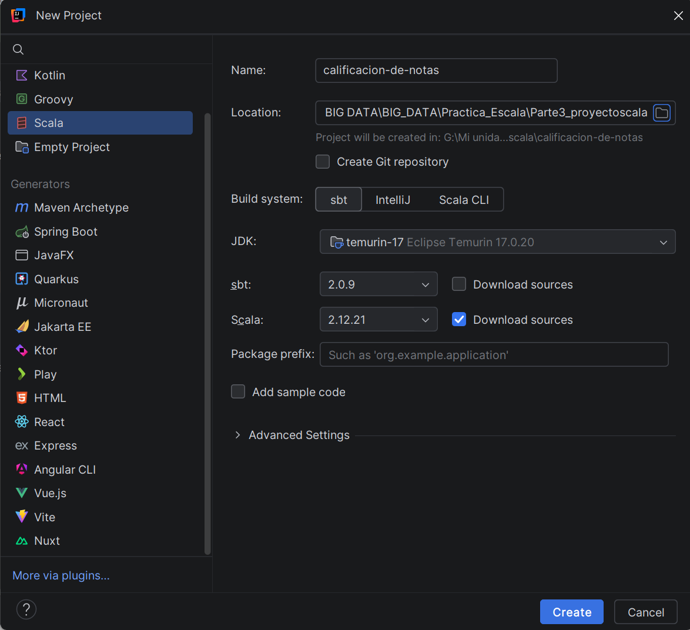


Primera parte de código con las variables y funciones a emplear al principio de la practica 

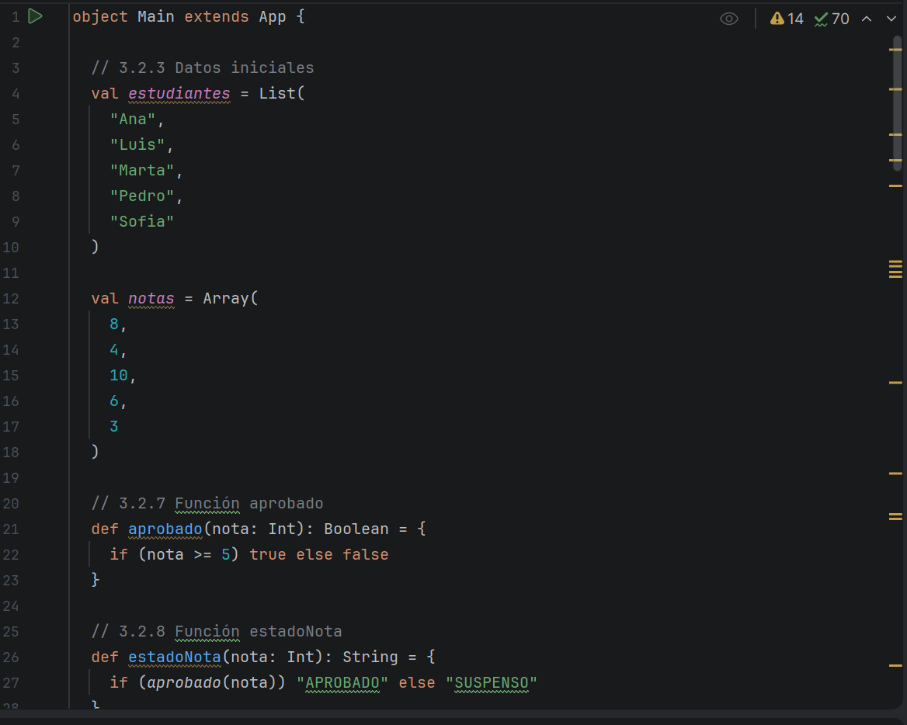

Segunda parte de las funciones planteadas y comienzo de las variables de las estadísticas a analizar

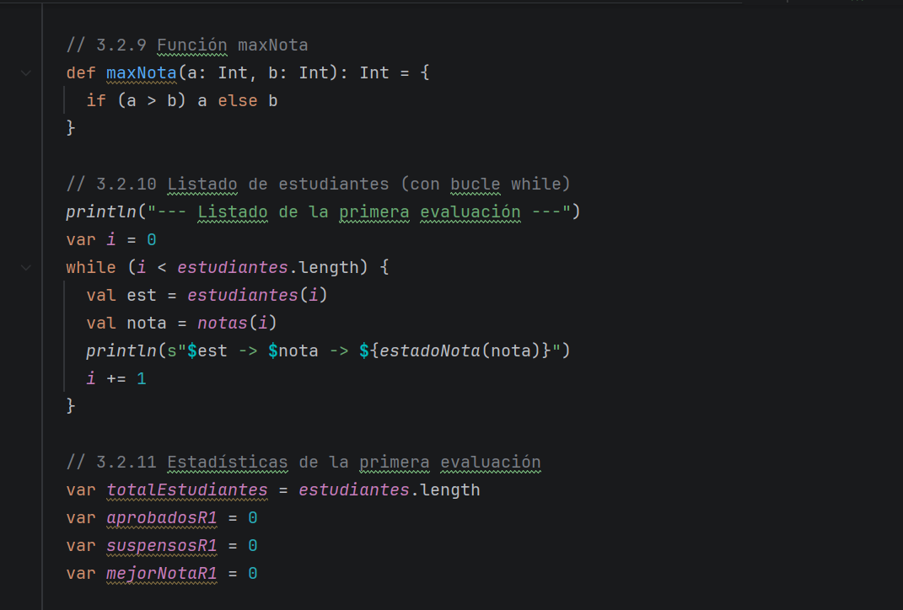

Bucle con las estadisticas y comienzo de las estadísticas detalladas 

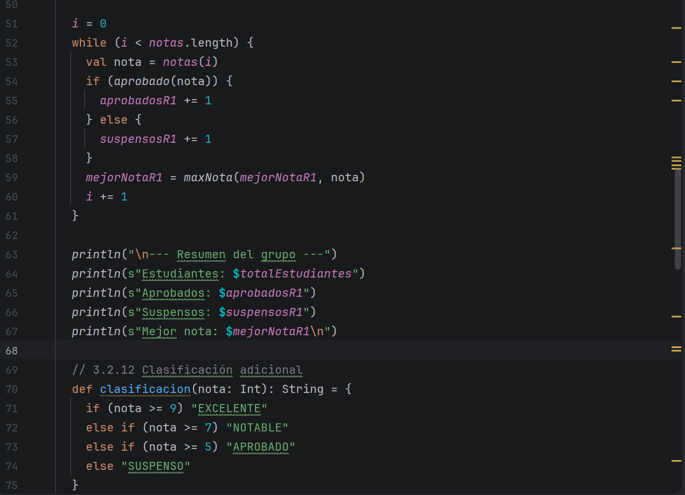

Datos de la segunda evaluacion 

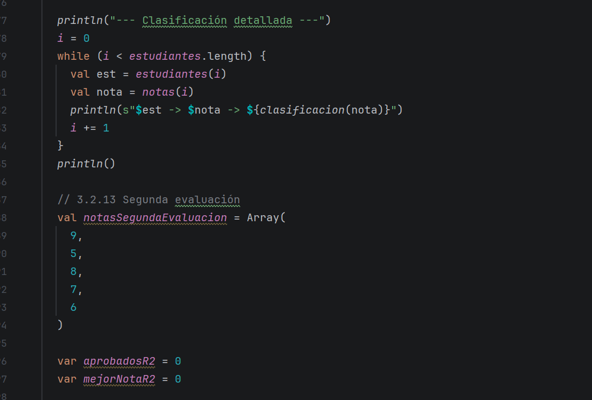

impresión de la información de la segunda evaluación 

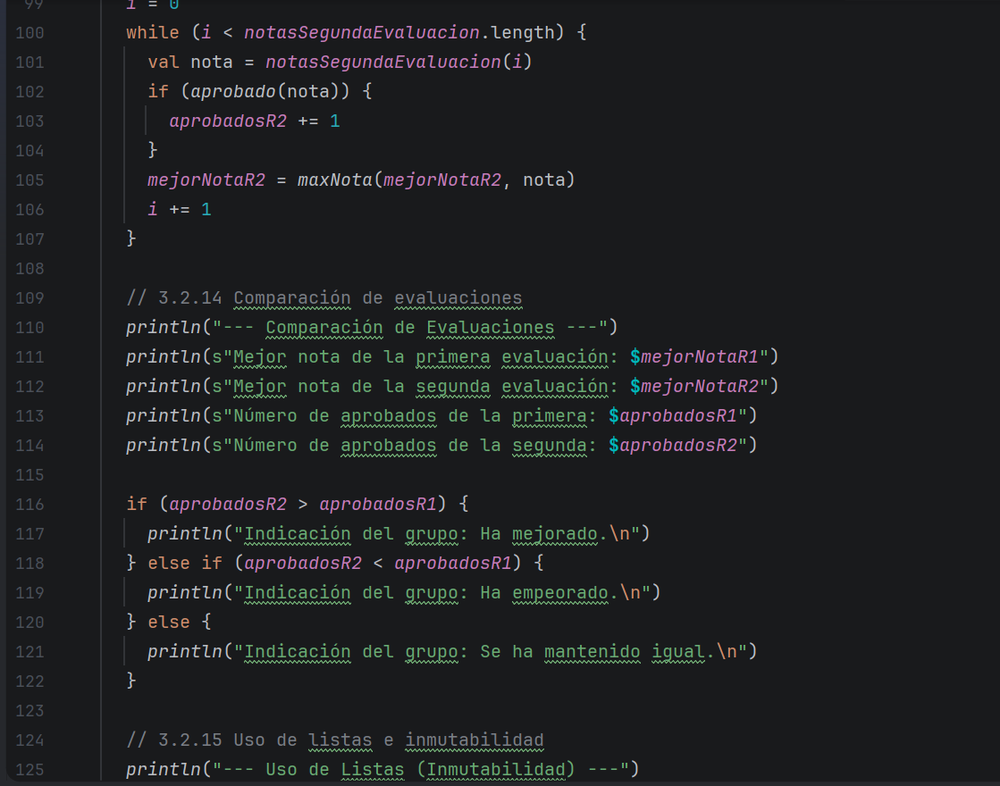

Listas 

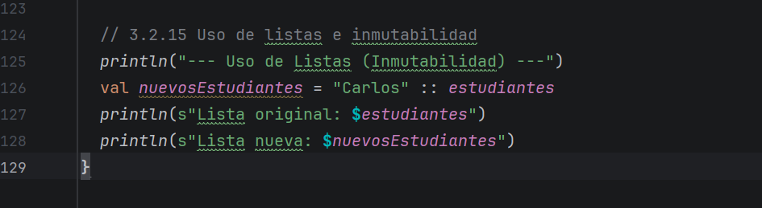

### 3. Explicación sobre la inmutabilidad de las listas (`::`)

- **¿Por qué la lista original no se modifica?** En Scala, las listas estándar (`List`) son **inmutables** por diseño. El operador de construcción de listas (`::`, conocido como *cons*) no muta ni altera el objeto subyacente existente en la memoria. En su lugar, crea y devuelve una **nueva** estructura de datos que apunta al nuevo elemento añadido en la cabeza y enlaza el resto con la lista original. Esto garantiza la seguridad frente a efectos secundarios indeseados en el código.

comprobacion de  sbt compile y run 

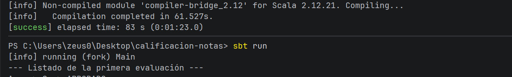

impresion de la consola

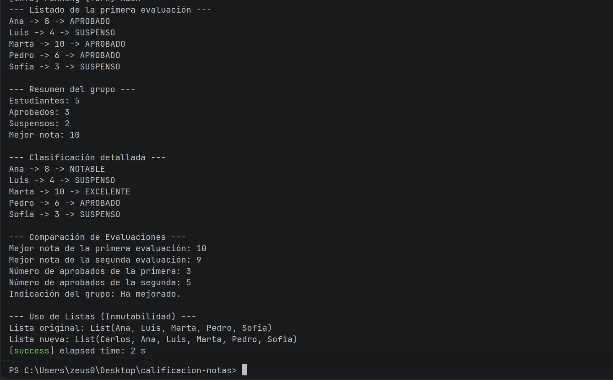