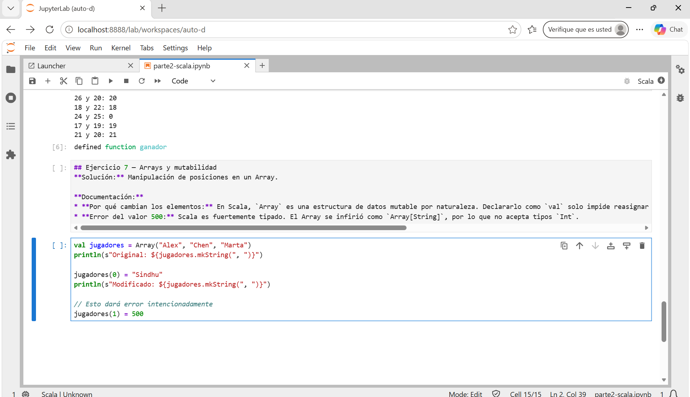
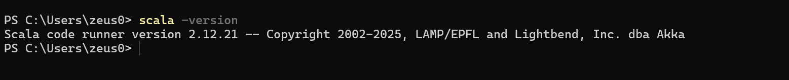
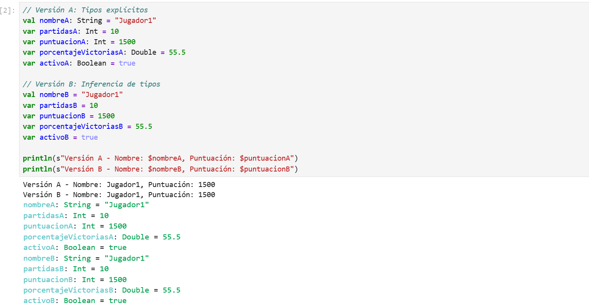
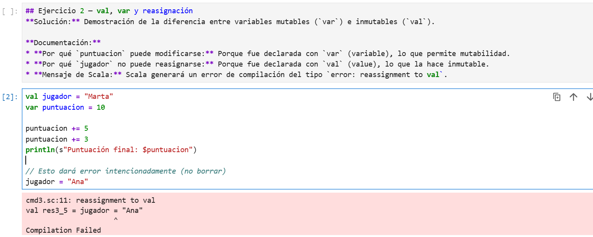
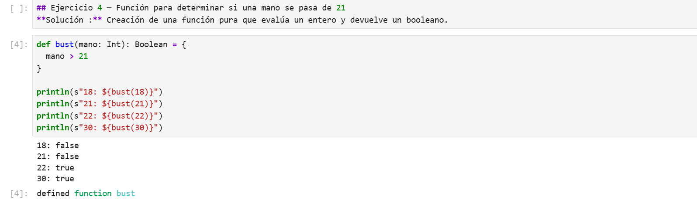
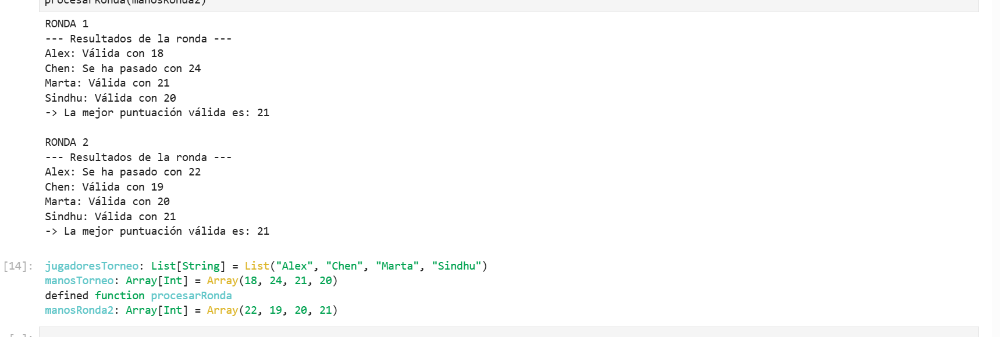

# Parte 2 — Programación con Scala

## Entorno utilizado

-JupyterLab
-Almond Kernel
-Scala 2.12.21

## Contenido

Esta parte contiene 15 ejercicios de programación realizados en Scala utilizando JupyterLab. Los ejercicios están basados en los capítulos 1, 2 y 3 del material del curso y cubren los siguientes conceptos:

- Declaración de variables con `val` y `var`.
- Tipos de datos básicos e inferencia de tipos.
- Definición y uso de funciones puras e impuras (efectos secundarios).
- Creación, inicialización y recorrido de `Array` (mutabilidad).
- Creación y concatenación de `List` con `Nil`, `::` y `:::` (inmutabilidad).
- Estructuras de control de flujo (`if`, `else if`, `else`, `while`, `foreach`).
- Operadores relacionales y lógicos.
- Comparativa entre los estilos de programación imperativo y funcional.

## Notebook

[Ver Notebook de la Parte 2](parte2-scala-checkpoint.ipynb)

## Evidencias

Entorno Jupyter con escala

version Scala

Bateria de ejercicios

Ejercicio 1

Ejercicio 2

Ejercicio 4

Ejercicio 15

