# Practica Introducción a Scala ⅓

## 1. Introducción

En esta primera practica vamos a seguir los pasos necesarios para la creación y preparación del entorno de trabajo para Escala. Escala es uno de los lenguajes de programación mas usados por su robustez, potencia, y flexibilidad para ciencia de datos. A continuación vamos a seguir los pasos planteados en la practica para el completo desarrollo de esta.

## Parte 1 — Entornos de trabajo

Deberás preparar tres entornos independientes de desarrollo.
Los tres entornos deberán quedar configurados para trabajar con:

- Scala 2.12.21
- Java / JDK 17, cuando sea necesario.
- Windows 11 como sistema operativo.

Los entornos serán:

1. JupyterLab + Almond Kernel + Scala 2.12.21
2. Visual Studio Code + Metals + Scala 2.12.21 + JDK 17 + sbt
3. IntelliJ IDEA Community + Scala 2.12.21 + sbt

### 1.1 Entorno 1 — JupyterLab + Almond Kernel + Scala 2.12.21

#### Objetivo

Preparar un entorno interactivo basado en **JupyterLab** que permita crear notebooks y ejecutar código utilizando **Scala 2.12.21** mediante el **Almond Kernel**.
El uso de notebooks permite ejecutar instrucciones de forma interactiva y observar inmediatamente sus resultados, de manera similar al uso del intérprete de Scala presentado durante el curso.

#### Actividades

#### 1. Instalar los requisitos necesarios

Instala en Windows 11 las herramientas necesarias para poder utilizar:

- JupyterLab.
- Almond Kernel.
- Scala 2.12.21.

Documenta cualquier requisito adicional que hayas necesitado instalar para que el entorno funcione correctamente.

#### 2. Instalar JupyterLab

Realiza la instalación de JupyterLab y comprueba que puedes iniciarlo correctamente desde Windows.

**2.1 Método de instalación de JupyterLab**
Comprobamos primero si tenemos instalado python con el comando `python --version`

Ahora realizamos con pip la instalacion del jupyterlab con esta secuencia de comandos:

- `python -m pip install --upgrade pip`: Instalación de pip
- `python -m pip install jupyterlab`: Instalación de jupyterlab
- `python -m jupyterlab --version`: Para comprobar que se ha instalado correctamente

**2.2 Comando o procedimiento utilizado para iniciar JupyterLab.**
Ahora seguiremos los pasos para llegar a la interfaz de jupyterlab siendo meramente dos:

- `python -m jupyterlab`: Este comando nos abría el navegador redirigiendonos a nuestro lab de jupyter lab

Resultando en esta interfaz:
AÑADIR INTERFAZ

**2.3 Navegador o interfaz desde la que accedes al entorno.**
Una vez hemos conseguido llegar a la interfaz ahora nos moveremos por ella.
Imagen de la consola de jupyterlab:

#### 3. Instalar Almond Kernel (2.4)

Ahora para poder emplear el notebook correspondiente de scala con jupyterylab vamos a proceder con unas comprobaciones previas antes de la instalación:

- `java -version`: Para ver la version que tenemos de java antes de proceder

Una vez demostrado que tenemos JDK instado procedemos con la instalacion de Scala mediante la herramienta oficial recomendada Coursier.

Ahora ejecutaremos los comando para la instalación de la versión precisa de scala 2.12.21:

- `cs install scala:2.12.21`_[image]_
- `cs install scalac:2.12.21`_[image]_

Scala esta instalado en la version que queremos comprobado con `scala -version`:
_[image]_

Instalamos almond kernel:

- `cs launch almond:0.14.5 --scala 2.12.21 -- --install`

Comprobamos la lista de kernels de jupyter:

- `jupyter kernelspec list`
  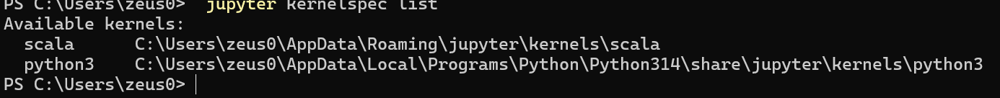

**2.5 Ejecutar código Scala**
Ahora en el labs seleccionaremos la opcion de `file -> new -> notebook -> scala`

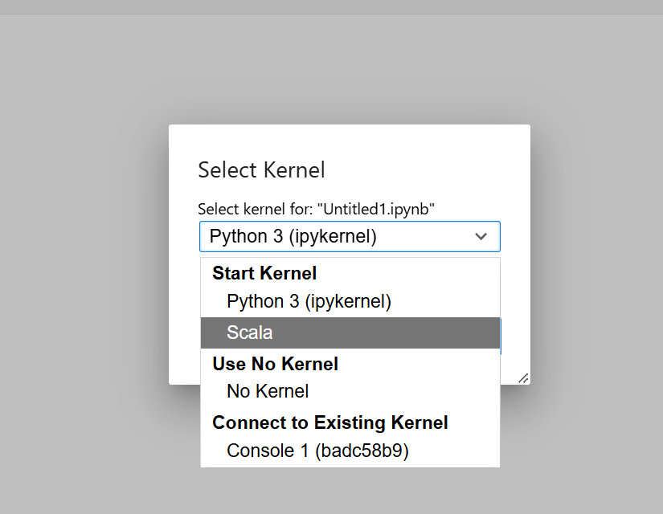

Ahora estas son las evidencias de que todo lo anterior ha funcionado:
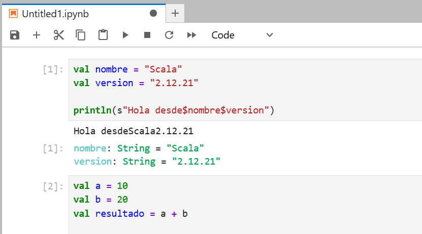
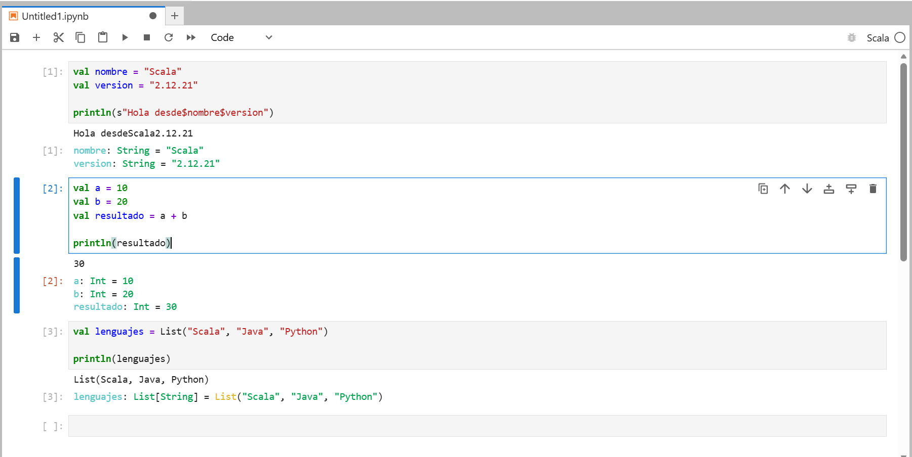
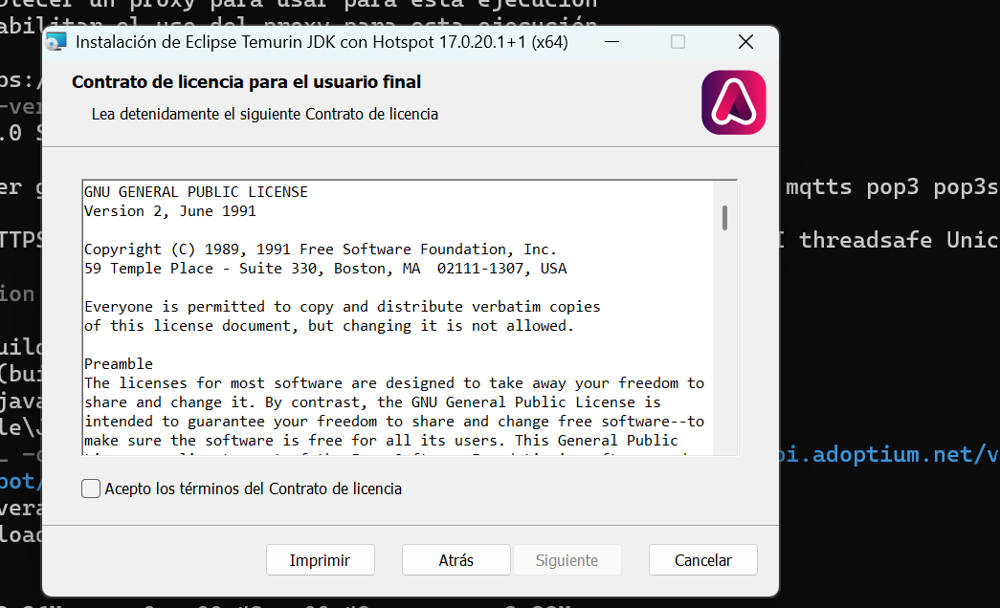

### 1.2 Entorno 2 — Visual Studio Code + Metals + Scala 2.12.21 + JDK 17 + sbt

**Configuración de JDK 17**
Como mi equipo ya posee de un JDK 27 vamos a configurar para que escala emplee directamte el JDK 17 sin romper lo demas.
Descargar Temurin JDK 17:

```powershell
curl.exe -L -o "$env:USERPROFILE\Downloads\OpenJDK17.msi" "<https://api.adoptium.net/v3/installer/latest/17/ga/windows/x64/jdk/hotspot/normal/eclipse>"
```

Cuando termine ejecutamos el instalador:

```powershell
Start-Process "$env:USERPROFILE\Downloads\OpenJDK17.msi"
```

Despues comprobar si hemos instalado correctamente el JDK 17:

Comprobamos tambien con el comando de `javac -version`:
![]

**Intalacion de metals**
Una vez instalado mediante su enlace oficial vs code iremos al apartado de extensiones y buscaremos la palabra de Metals y la instalamos.

Comprobación de sbt mediante `sbt --version`:
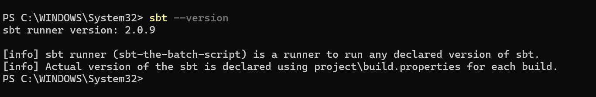

**Proyecto Scala**
Creación de un proyecto scala con la siguiente estructura de datos:

```
scala-vscode/
├── build.sbt
├── project/
└── src/
    └── main/
        └── scala/
            └── Main.scala
```

Resultando asi la siguente estructura de proyecto:

Configuramos scala en el archivo `build.sbt`:
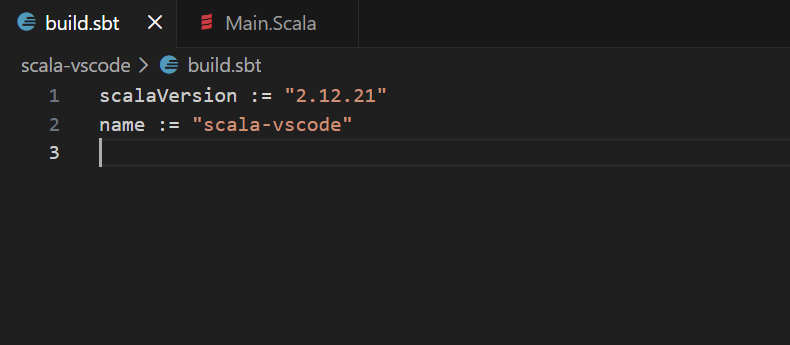

Creamos un pequeño programa en `Main.scala`:
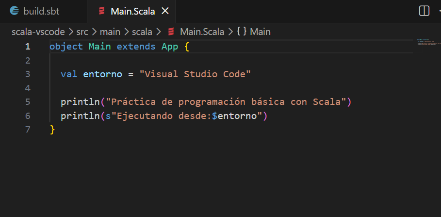

**Importacion y compilacion del proyecto con metals**
Al abrir la carpeta del proyecto se han instalado los archivos de metals detectando el proyecto automaticamente:
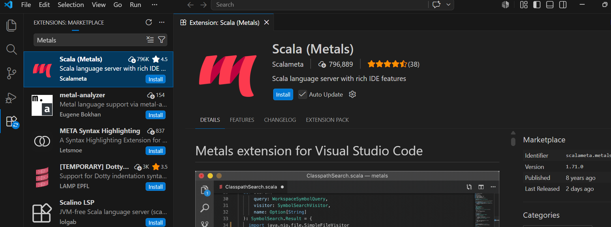
Ahora vamos a compilar el proyecto `sbt compile` y ejecutarlo con `sbt run`:
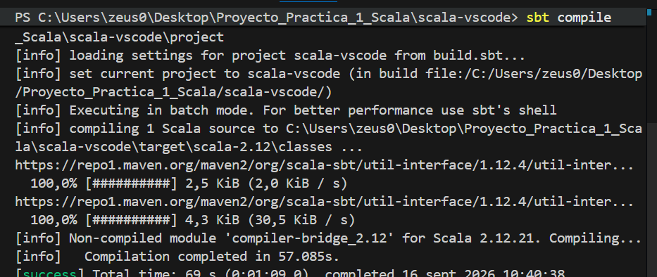
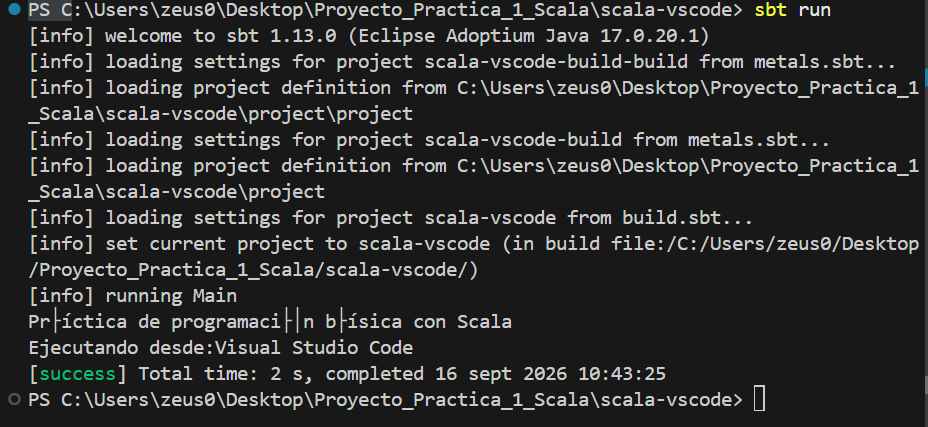

# 1.3 Entorno 3 — IntelliJ IDEA Community + Scala 2.12.21 + sbt

## Objetivo

El objetivo de esta actividad es preparar un segundo entorno de desarrollo para trabajar con Scala utilizando un IDE completo.

Para ello se utilizarán las siguientes herramientas:

- IntelliJ IDEA Community Edition.
- Plugin de Scala.
- JDK 17.
- Scala 2.12.21.
- sbt.

El material del curso presenta los IDE como herramientas especialmente útiles para trabajar con proyectos formados por múltiples archivos. Entre los entornos utilizados para desarrollar aplicaciones Scala se encuentra IntelliJ IDEA.

En esta actividad se configurará un proyecto Scala basado en sbt y se comprobará su funcionamiento tanto desde IntelliJ IDEA como desde la terminal mediante sbt.

## 1. Instalar IntelliJ IDEA Community Edition

Para comenzar la configuración del entorno se ha instalado **IntelliJ IDEA Community Edition**.

IntelliJ IDEA es un entorno de desarrollo integrado que permite trabajar con diferentes lenguajes de programación y proporciona herramientas para gestionar proyectos, editar código, ejecutar aplicaciones y depurarlas.

### Instalación

Se descarga e instala IntelliJ IDEA Community Edition.

Una vez finalizada la instalación, se inicia el programa para comprobar que funciona correctamente.

### Comprobación

Al iniciar IntelliJ IDEA se muestra la interfaz principal del programa desde la que se pueden crear y abrir proyectos.

### Evidencia

**Captura 1:** IntelliJ IDEA Community Edition instalado y abierto.


## 2. Instalar el soporte para Scala

Para poder desarrollar aplicaciones Scala desde IntelliJ IDEA es necesario instalar el plugin correspondiente.

El plugin utilizado es:

**Scala**
Este plugin proporciona soporte para el lenguaje Scala dentro de IntelliJ IDEA

### Instalación del plugin

Desde IntelliJ IDEA se ha accedido al apartado de plugins y se ha buscado el plugin:

```
Scala
```

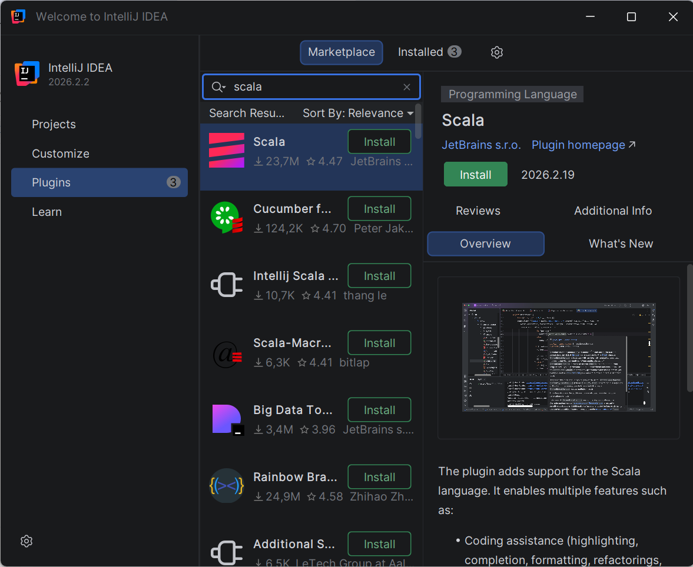

## 3. Configurar JDK 17

lo configuramos del projecto dejando que nos lo instale el propio configurador del proyecto

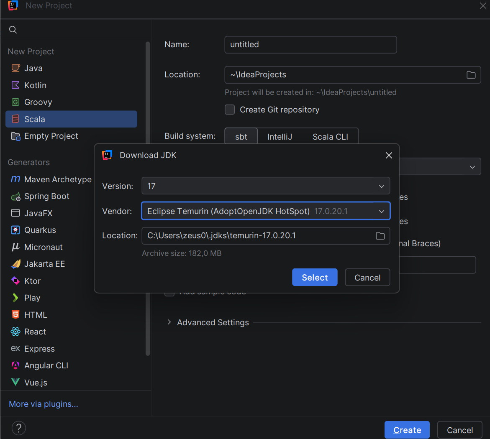

## 4 Crear un proyecto Sbt

Seleccionamos el nombre y la opción de sbt para la configuración de nuestro proyecto

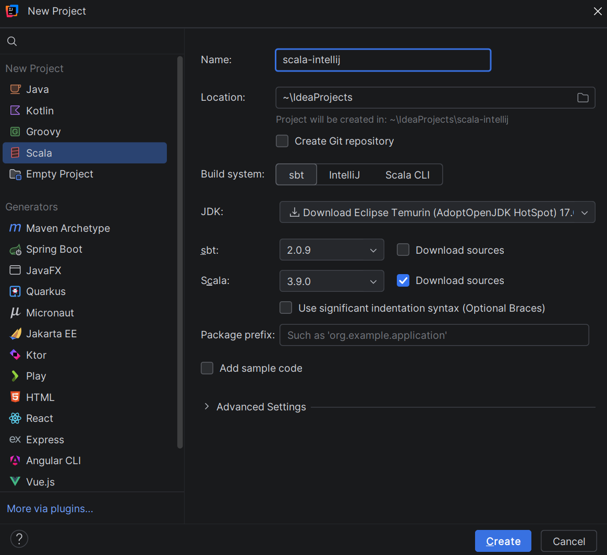

## 5 Revisión del archivo build

comprobamos que la version y el nombre son correcto s

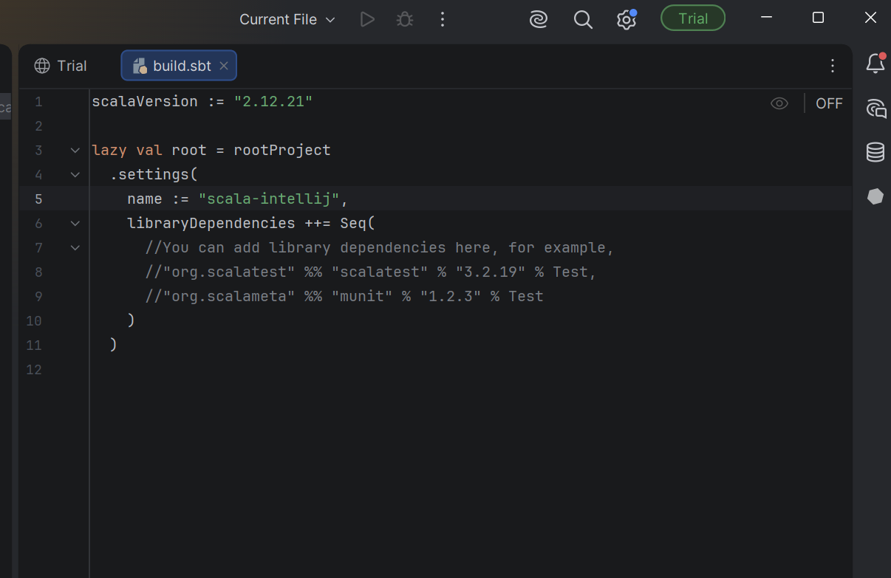

## 6 Creación del programa

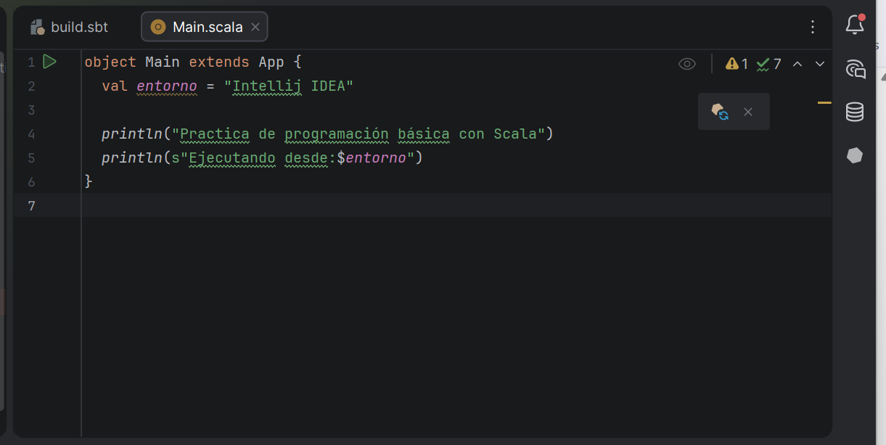

## 7 Ejecución del IDEA

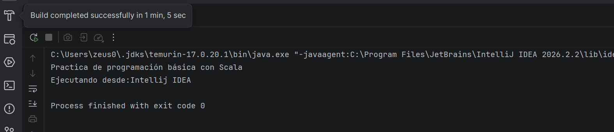

## 8 Compilacion sbt

debemos configurarlo en la consola de sbt propia del idea

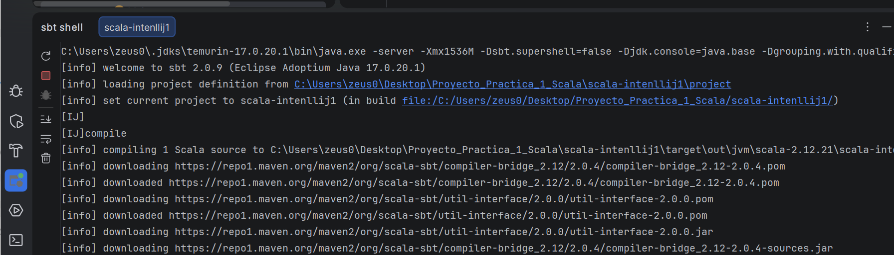

## 9 Ejecucion sbt

igual que el paso previo

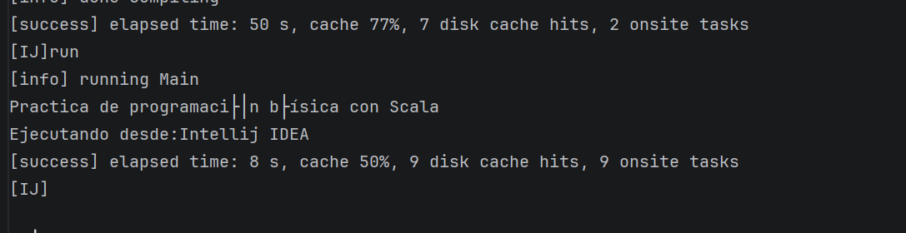
